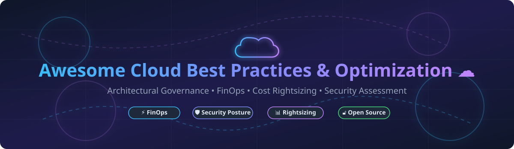

# Awesome-Cloud-Best-Practices-Optimization ☁️ 🏆

  

  
  
  
  
  
  

---

## 🌟 Top Cloud Best Practices & Optimization Ecosystem 🚀

**Curated List of Commercial Cloud Advisory Platforms & Open-Source Optimization Tools**  
*Focused on Cost Optimization, Security Posture, Performance Efficiency, Operational Excellence & Self-Hosted Cloud Assessment* 💡

**Last updated: October 2026** 📅

---

### 📌 Overview & SEO Summary 🔍

Welcome to the ultimate curated directory of **cloud best practices platforms**, **cost optimization engines**, **FinOps tools**, and **open-source cloud assessment frameworks** ⚡. Whether you are looking for enterprise-grade commercial solutions (such as *AWS Trusted Advisor*, *Azure Advisor*, *CloudHealth*, and *CloudZero*), or self-hostable open-source alternatives (like *Infracost*, *Steampipe*, *Prowler*, *Cloud Custodian*, and *Kubecost*), this repository provides comprehensive metadata, exact pricing structures, valuation metrics, and direct links to empower cloud architects, FinOps practitioners, and DevOps engineers 🛠️.

---

## 📑 Table of Contents 📖

- [🏢 SaaS & Commercial Platforms](#-saas--commercial-platforms)
- [🔓 Open-Source GitHub Projects](#-open-source-github-projects)
- [🛠️ How to Contribute](#%EF%B8%8F-how-to-contribute)
- [📊 Star History](#-star-history)
- [🤝 Support & Sponsorship](#-support--sponsorship)
- [⚠️ Disclaimer](#%EF%B8%8F-disclaimer)

---

## 🏢 SaaS / Commercial Platforms 🌐

> 📈 **Market Analysis & Fragmentation Overview**:  
> The global **Cloud Cost Management & FinOps Market** is estimated at **~$20.5 Billion in 2026** and projected to surpass **$38 Billion by 2030** (CAGR ~17.2%). The sector is **moderately fragmented**: hyper-scalers (AWS, Microsoft Azure, GCP) provide embedded baseline advisory engines, while enterprise platform acquirers (IBM, Broadcom/VMware, NetApp) and specialized high-growth FinOps startups (CloudZero, Vantage, Cast AI) compete for complex multi-cloud and Kubernetes workload optimization.

| SaaS / Commercial Platform | Company / Owner | Valuation / Market Cap 💰 | Standard Edition Starting Price 🏷️ | Free Tier / Free Trial Limits 🎁 | Description 📝 |
| :--- | :--- | :--- | :--- | :--- | :--- |
| **[Azure Advisor](https://azure.microsoft.com/en-us/products/advisor/)** 🔷 | Microsoft | ~$3.90 Trillion | **$0 / month** (included with Azure account) | **Free forever** for all standard recommendation categories | **Azure-native best practices advisor** — Personalized recommendations across reliability, security, performance, cost, and operational excellence. Integrates with Azure Resource Graph and Advisor Score 🛡️. |
| **[AWS Trusted Advisor](https://aws.amazon.com/premiumsupport/technology/trusted-advisor/)** ☁️ | Amazon | ~$2.0 Trillion | **$100 / month** minimum (requires AWS Business Support for 200+ full checks) | **7 core checks free forever** (Cost, Performance, Security baselines) | **AWS-native best practices advisor** — Evaluates account against five pillars: cost optimization, security, fault tolerance, performance, and service quotas ⚡. |
| **[Google Cloud Recommender](https://cloud.google.com/recommender)** 🌐 | Google (Alphabet) | ~$2.0 Trillion | **$0 / month** (included with GCP project) | **Free forever** (underlying resources billed normally) | **GCP-native recommendation engine** — Machine learning-driven suggestions for rightsizing, idle resource removal, committed use discounts, and IAM policy improvements 🤖. |
| **[IBM Turbonomic](https://www.ibm.com/products/turbonomic)** ⚙️ | IBM | ~$200 Billion | **$18.75 / month** per managed entity (or $2,500/mo base for enterprise) | **30-day free trial** with full platform access | **Application resource management (ARM)** — Public cloud optimization, Kubernetes optimization, and application/database resource optimization 📊. |
| **[Apptio Cloudability](https://www.apptio.com/products/cloudability/)** 💰 | IBM (Apptio) | ~$200 Billion (IBM) | **$2,500 / month** for up to $1M managed spend (via AWS Marketplace) | **Free tier: up to 3 cloud accounts** with 14-day history limit | **Percentage-of-spend FinOps platform** — Multi-cloud cost allocation, budgeting, and rightsizing with granular tag mapping 📈. |
| **[CloudHealth by VMware](https://www.cloudhealthtech.com/)** 🏥 | Broadcom (VMware) | ~$60 Billion | **$300 / month** (or 1% of monthly cloud spend, whichever is higher) | **14-day free trial** (up to 1,000 resources) | **Multi-cloud cost governance** — Rightsizing reports, tag-based cost allocation, custom reporting, and security policy checks 🛡️. |
| **[Spot by NetApp](https://spot.io/)** 🟢 | NetApp | ~$20 Billion | **$1.415 per 100 vCPU hours** (or 20% of net savings realized) | **Free tier: up to 20 compute VMs** managed continuously | **Cloud automation and optimization** — Continuous analytics for infrastructure optimization using Spot instances and automated container bin packing 📦. |
| **[Cast AI](https://cast.ai/)** 🎯 | Cast AI | ~$800 Million | **$1,000 / month base + $5 / vCPU / month** | **Free Monitoring tier: unlimited Kubernetes clusters**, read-only cost insights | **Kubernetes automation & cost optimization** — Automated autoscaling, Spot instance management, workload rightsizing at millicore level, and pod bin packing 🎯. |
| **[CloudZero](https://www.cloudzero.com/)** 📊 | CloudZero | ~$350 Million | **$1,500 / month** (platform base fee scaling with cloud spend) | **14-day free trial** for engineering telemetry & unit cost assessment | **Unit economics cloud cost platform** — Answers "What does it cost to serve this customer?" Allocation by customer, team, product, or microservice feature 💡. |
| **[Vantage](https://www.vantage.sh/)** 💵 | Vantage | ~$150 Million | **$30 / month + 3% of managed spend** (Pro Plan) | **Free Tier: 2 cloud accounts, 10 cost reports, 5 dashboards** | **Cloud cost transparency platform** — Multi-cloud cost visibility with savings opportunities via Compute Optimizer and Rightsizing 🔍. |

---

## 🔓 Open-Source GitHub Projects 🛠️

*Sorted by GitHub Stars Count (Descending)* 🌟

- **[Infracost](https://github.com/infracost/infracost)**  💰  
  **Cloud cost estimates for Terraform in pull requests**, Apache-2.0 licensed. **Shift-left FinOps** — displays the exact cost impact of infrastructure changes before deployment. Supports AWS, Azure, GCP, and **1,000+ Terraform resources**. Includes CLI, GitHub Actions, GitLab CI, and VS Code extensions 🚀.

- **[Steampipe](https://github.com/turbot/steampipe)**  🔗  
  **Query cloud APIs with SQL**, AGPL-3.0 licensed. **Zero-ETL approach** — query AWS, Azure, GCP, Kubernetes, and 100+ services directly using SQL. Enables custom cost reporting, security compliance auditing, and infrastructure posture verification without complex pipelines 📊.

- **[Cloud Custodian](https://github.com/cloud-custodian/cloud-custodian)**  🛡️  
  **Rules engine for cloud security, cost optimization, and governance**, Apache-2.0 licensed. **YAML-based policies for AWS, Azure, GCP** — no custom code required for standard policies. Offers automated remediation: tag enforcement, idle resource cleanup, rightsizing, and compliance auditing ⚙️.

- **[Prowler](https://github.com/prowler-cloud/prowler)**  🔒  
  **Comprehensive multi-cloud security assessment tool**, Apache-2.0 licensed. Features **800+ security checks** across AWS, Azure, GCP, and Kubernetes aligned with CIS Benchmarks, NIST, PCI-DSS, GDPR, HIPAA, and SOC2. Outputs OCSF v1.1.0 JSON format 🛡️.

- **[CloudQuery](https://github.com/cloudquery/cloudquery)**  📦  
  **High-performance cloud asset inventory & CSPM engine**, MPL-2.0 licensed. Extracts multi-cloud configurations (AWS, Azure, GCP, K8s) into PostgreSQL, Snowflake, or BigQuery for SQL-driven FinOps and security compliance modeling 🔎.

- **[Komiser](https://github.com/tailwarden/komiser)**  🔍  
  **Multi-cloud resource visibility & cost management**, Apache-2.0 licensed. Supports AWS, Azure, GCP, DigitalOcean, Linode, and Kubernetes. Detects unattached volumes, idle IPs, untagged assets, and overprovisioned compute nodes 💻.

- **[OpenCost](https://github.com/opencost/opencost)**  🌱  
  **CNCF Sandbox project for real-time Kubernetes cost monitoring**, Apache-2.0 licensed. Originally open-sourced by Kubecost. Provides granular cost allocation by cluster, node, namespace, controller, service, and pod across AWS, Azure, and GCP ☸️.

- **[Karpenter](https://github.com/kubernetes-sigs/karpenter)**  ⚡  
  **Kubernetes Node Autoscaling & Compute Optimizer**, Apache-2.0 licensed. Automatically launches optimal, rightsized EC2/Cloud compute instances in response to unschedulable pods, significantly reducing Kubernetes compute spend 🚀.

- **[Kube-capacity](https://github.com/robscott/kube-capacity)**  📊  
  **CLI tool for Kubernetes resource requests, limits, and utilization**, Apache-2.0 licensed. Provides a clean tabbed overview of resource allocation across pods, nodes, and namespaces to identify cluster overprovisioning 🖥️.

- **[Kubecost (Open Source Core)](https://github.com/kubecost/cost-analyzer-helm-chart)**  💰  
  **Kubernetes cost monitoring and optimization chart**, Apache-2.0 licensed. Free tier provides monitoring for unlimited clusters with a $100K spend cap over 30 days. EKS-optimized bundle includes full integration with AWS Billing APIs 🏷️.

- **[Cloud Carbon Footprint](https://github.com/cloud-carbon-footprint/cloud-carbon-footprint)**  🌍  
  **Estimate and visualize cloud carbon emissions & energy consumption**, Apache-2.0 licensed. Correlates cloud usage and spend across AWS, Azure, and GCP with environmental impact metrics to drive Green FinOps initiatives 🍃.

- **[AutoSpotting](https://github.com/AutoSpotting/AutoSpotting)**  ⚡  
  **Automated AWS EC2 Spot instance converter**, Opt-Out / Apache-2.0 licensed. Automatically replaces existing On-Demand EC2 instances in Auto Scaling Groups with cheaper Spot instances of equivalent specs without changing group configurations ⚡.

- **[c3x](https://github.com/c3xdev/c3x)**  🏗️  
  **Cloud cost estimation engine for Terraform, Terragrunt, and CloudFormation**, Apache-2.0 licensed. Operates completely offline without API keys to deliver pre-deployment budget guardrails and what-if financial analysis 📉.

- **[AWS Cost Explorer CLI](https://github.com/aws/aws-cost-explorer-cli)**  🖥️  
  **CLI tool for querying AWS Cost Explorer APIs directly**, Apache-2.0 licensed. Facilitates terminal-based cost analysis, automated report export, and integration into CI/CD FinOps scripts ⌨️.

- **[Azure Cost CLI](https://github.com/mivano/azure-cost-cli)**  🔵  
  **Command-line interface for Azure Cost Management**, MIT licensed. Performs quick daily/monthly spend analysis, subscription breakdowns, and budget alerts directly from shell sessions 💻.

---

## 🛠️ How to Contribute 🤝

Contributions are welcome! Follow these steps to submit new cloud best practices platforms or open-source optimization software:

1. 🍴 **Fork** the repository.
2. 📝 **Add/edit** entries in `README.md` maintaining table/list structure and formatting.
3. 🔗 Include project title, official website/GitHub link, exact Stars_Count, license, and brief description.
4. 🚀 Submit a **Pull Request** with a descriptive summary of your changes.

---

## 📊 Star History

---

## 🤝 Support & Sponsorship ❤️

If you find this cloud best practices and optimization repository useful, please consider supporting the project:

- ⭐ **Star** this repository to increase visibility!
- 🔀 **Fork** and share with fellow FinOps engineers, cloud architects, and open-source advocates.
- ☕ **Sponsor & Buy Me a Coffee**: Support ongoing open-source curation via the [GitHub Sponsor Dashboard](https://github.com/sponsors/ishandutta2007).

---

## ⚠️ Disclaimer ℹ️

- This is a **community-curated** list — not exhaustive and not an official endorsement ℹ️.
- Commercial platform pricing and free tier terms are subject to changes by respective cloud vendors. Always verify specs against official cloud provider consoles ☁️.
- Open-source tools provide self-hosted ownership and auditability; always test rules in non-production environments prior to enforcing automated cleanup policies 🛡️.

---

  <b>Made with ❤️ for FinOps engineers, cloud architects, and open-source optimization advocates.</b>

